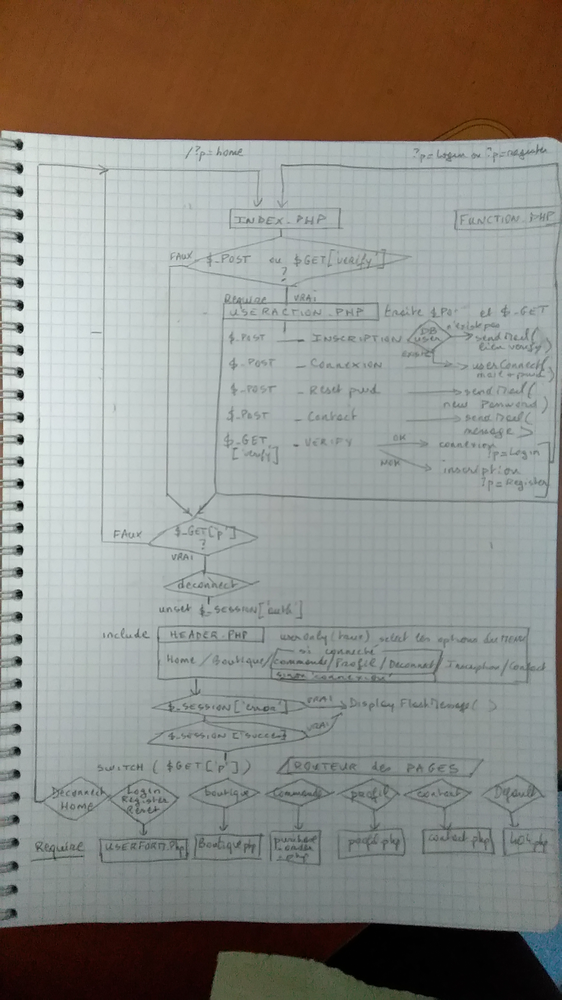

# Sitebiere "Bread Beer Shop" corrigé par Julien et Kevin

## Site de commande de bières contenant :

## - La première page : Accueil
Un menu dans le Header de toutes les pages :
### Home
### Boutique
### Connexion
### Bon de commande
### Profil
### Déconnexion
### Inscription
### Contact

## - "Boutique" : Affiche les produits (bières)

## - "Connexion" permet de saisir son adresse mail et son mot de passe pour se connecter, et disparait si la connexion réussit pour faire apparaitre "Bon de commande", "Profil" et "Déconnexion"

## - "Bon de Commande" affiche le bon de commande à envoyer :
### un formulaire contient le nom et les coordonnées de l'acheteur
et un tableau contient le nom de la bière, le prix HT et TTC et la quantité à saisir par ligne
### le changement de quantité calcule automatiquement les prix HT et TTC de la ligne
### un bouton "envoyer" affiche la page de confirmation de la commande :
un tableau qui récapitule les bières commandées, les frais de port (5.40 € si le total TTC dépasse 30 €) et le total à payer

## - La page 'Profil' contient :
### les coordonnées en formulaire à envoyer pour les modifier
### un formulaire pour changer son mot de passe
### la liste des commandes enregistrées dans la base
### un lien par commande avec le n° de la commande et le total TTC de la commande

## - "Déconnexion" déconnecte l'utilisateur et affiche la page "Identification"

## - "Inscription" permet de saisir ses coordonnées, son adresse mail et son mot de passe pour s'inscrire', envoie un mail de confirmation pour valider l'inscription.

## - La validation de l'inscription affiche la page de connexion

## - Contact affiche un formulaire de contact

## 

